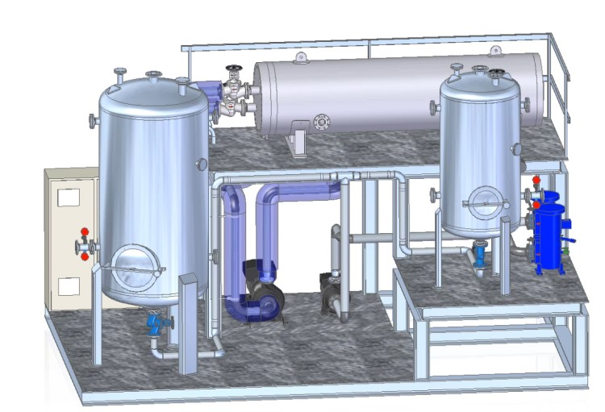

<!DOCTYPE html>
<html>
<head>
  <meta charset="UTF-8">
  <title>Mi Currículum</title>
  <meta name="viewport" content="width=device-width, initial-scale=1.0">
  <link rel="stylesheet" href="css/styles.css">
  <link rel="stylesheet" href="css/mediaqueries.css">
  <link rel="shortcut icon" href="img/atom.jpg">
  <link rel="stylesheet" href="https://cdnjs.cloudflare.com/ajax/libs/font-awesome/4.7.0/css/font-awesome.min.css">

</head>
<header>
  

  <a class="active" href="#"><i class="fa fa-fw fa-home"></i> Home</a> 
  <a href="#"><i class="fa fa-fw fa-search"></i> Search</a> 
  <a href="#"><i class="fa fa-fw fa-envelope"></i> Contact</a> 
  

</header>
<body>

  

  <h1>Mi Currículum  </h1>
  
  

  <h2>Mi Portafolio</h2>

 
  

    
    
    
    
    
    
       
  

  

    
    
    
    
    
   
  
  
  

    
    
    
    
    

  

  

    
    
    
    
    
   
  

  

    
    

    
Hello, Lorem ipsum dolor sit amet, consectetur adipisicing elit. Dignissimos earum neque quo et, facere accusantium tempora veniam, eos amet sed quas harum. Facere fugit dolorem, veritatis nesciunt voluptatum, quis est.

    

    

    
 
    <h3>Some my work</h3>
    
Lorem ipsum dolor sit amet, consectetur adipisicing elit. Corrupti unde quam deserunt dicta eum, esse beatae possimus necessitatibus. Dolorem, vero! Odio aperiam vitae inventore omnis illo nobis veniam eius id.

    

  

    <h2>Contáctame</h2>

<main class="contacto">
    <form action="">
      <label for="name">Nombre(s)</label>
      <input type="text" name="name" placeholder="Tu nombre">
      <!-- apellido -->
      <label for="lastname">Apellidos</label>
      <input type="text" name="lastname" placeholder="Tu apellido">
      
      <label for="mensaje">Mensaje</label>
      <textarea name="" id="" cols="30" rows="10" placeholder="Deja aquí tu mensaje"></textarea>
      <input type="submit">
    </form>
  </main>

<footer>
  <section class="redes">
      
      
      
    </section>

    
  

</footer>
</body>
